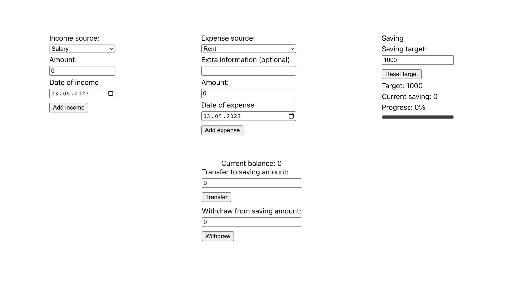
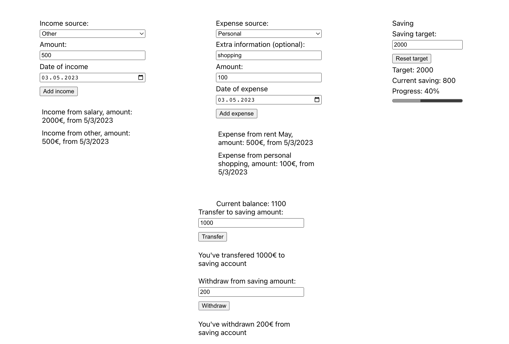
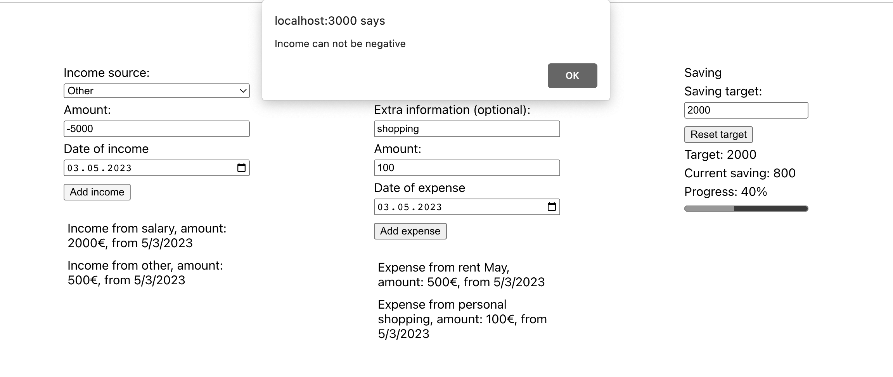
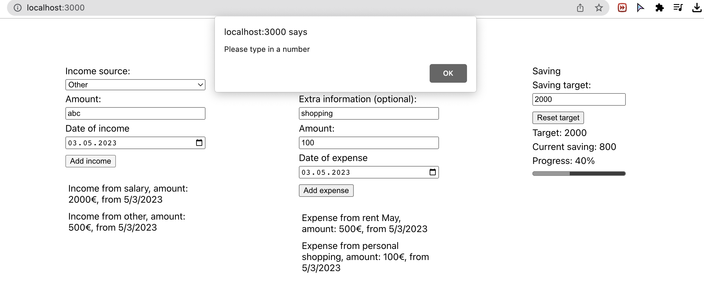
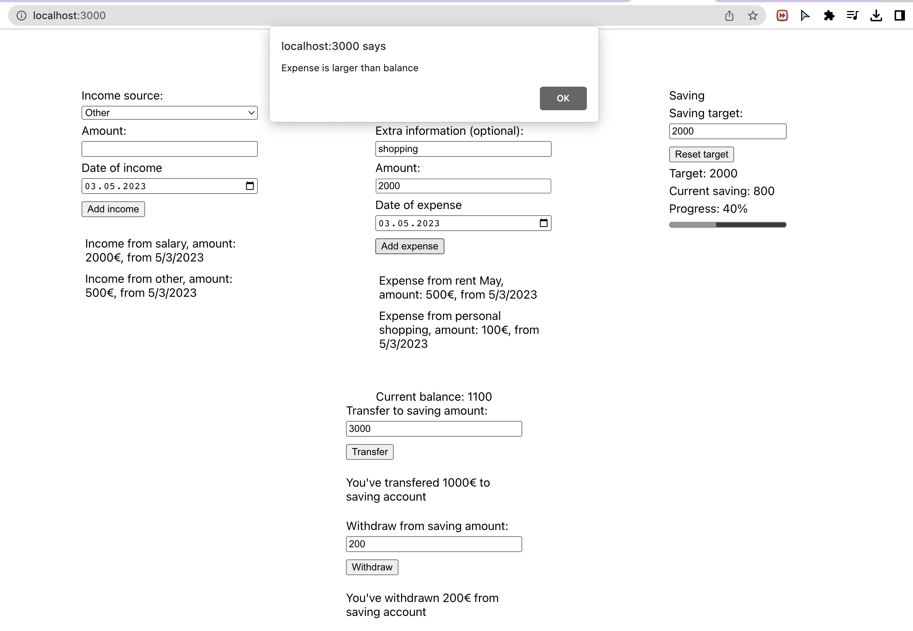
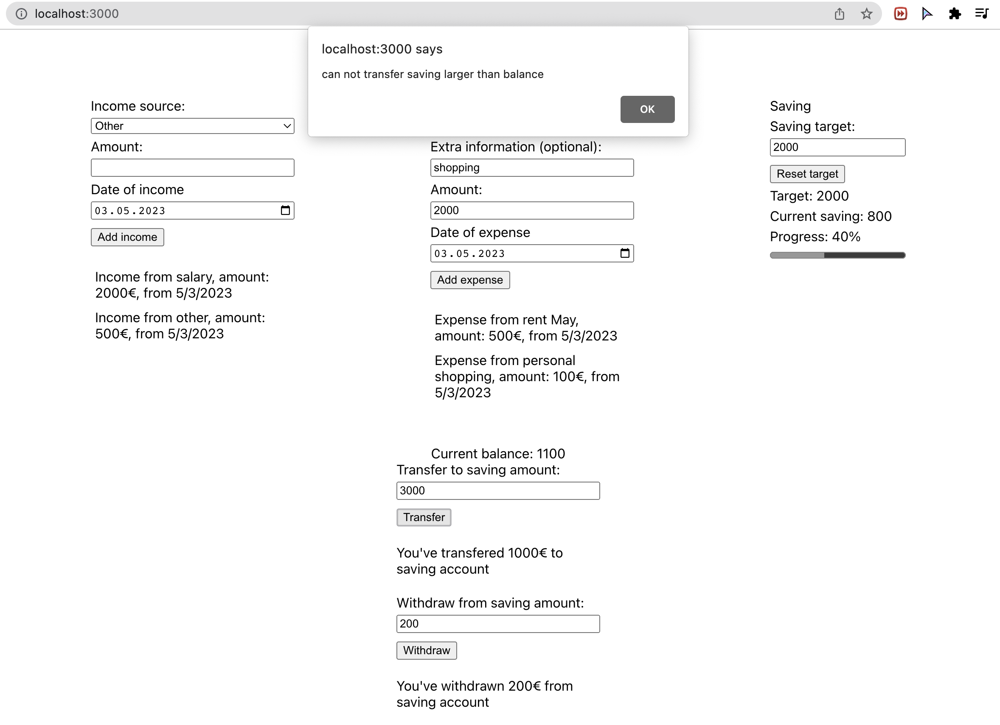

# Getting Started with React Components & React Hooks

This assignment requires also TypeScript when passing props to React Components

## Requirements

1. Create a simple one-page application to store incomes and expenses, and set
saving target.
2. Account balance can be calculated from incomes, expenses, and saving.
`incomes - expenses - saving = balance`
3. Users should be able to add new incomes, expenses, transfer from balance account to saving account, and reset saving target. Balance should never be negative number.
4. Use React Hooks where applicable. TypeScript must be used at least for the props types.
5. Style is not the priority in this assignment.

## Bonus point

1. Add function to transfer money back from saving account to current balance.
2. Set source of incomes and expenses as the select elements with the categories of your choice.
3. Add edit/delete button and according functions for incomes and expenses.
4. Use `d3` package to print out 2 piecharts for incomes and expenses in categories (I only give bonus point when you use `d3`, not the other handier libraries).

## References

Be creative with your style!

---

---

## Result
[Live demo can be found here](https://khanhngguyen.github.io/fs15_7-budget-app/)

Demo with inputs

Demo of conditional input, e.g: income amount can't be negative

Another example: input must be a number

Other condition example: can't make expense that is larger than current balance

Another condition example: can't transfer a saving amount that is larger than current balance

